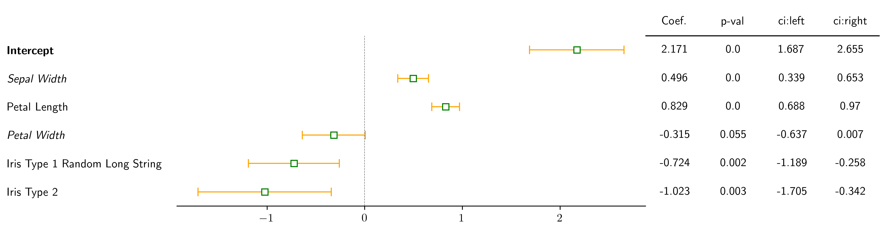

<h1 align="center">CoefPlot</h1>

  

Code to generate coefficient plots (example above) with a table on the vertical axis.

For example code, see the [notebook](https://github.com/surajrn/CoefPlot/blob/master/docs/CoefPlots.ipynb) in the docs folder. 
