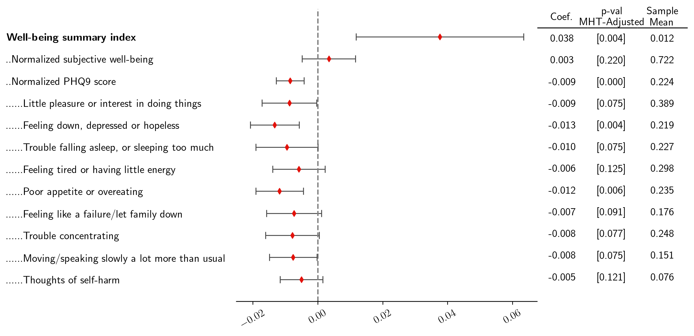

<h1 align="center">CoefPlot</h1>

  

Code to generate coefficient plots with a table. Was created to present regression results alongwith additional details. 

For example code, see the [CoefPlots](https://github.com/surajrn/CoefPlot/blob/master/CoefPlots.ipynb) notebook in the main folder.
